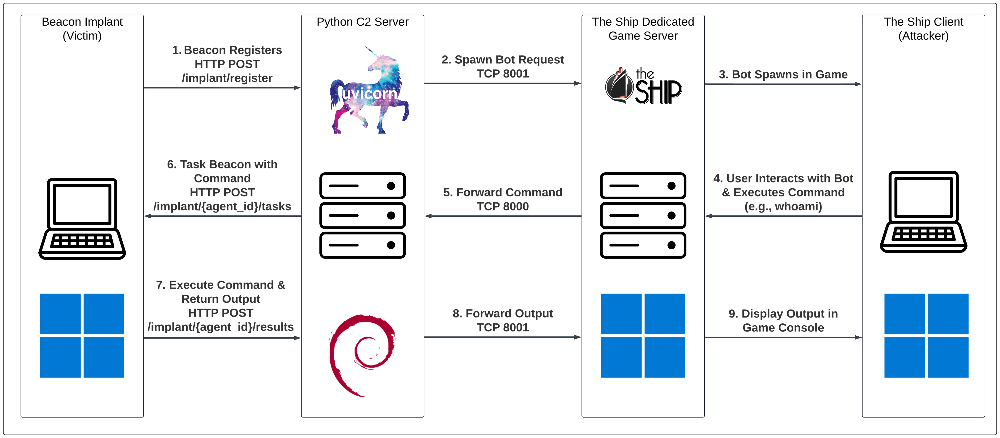

# Introduction
A fully functional Command & Control (C2) framework integrating 2006 Source Engine game The Ship.
> *The Ship? And I'm loading it up...*

## Background
The Ship is a unique 2006 first-person game where players are tasked with murdering an assigned target while avoiding being killed by their own hunter, all on board 1920s luxury cruise ships.

## Architecture


## Demo
<video controls src="https://github.com/xp101t/TheShip/raw/refs/heads/main/demo.mp4" title="demo" width="100%"></video>

## Usage
When a beacon connects to the C2, a corresponding bot will spawn in-game. Interacting with the bot, then pressing `ESC` will open a command execution menu. If a command is executed, the output will be displayed in the developer console (`~`).
___

# Setup

## Python C2 Server
1. Download `server.py` to working directory, edit `GAME_SERVER_IP`.

2. Start server with uvicorn.
```
uvicorn server:app --host 0.0.0.0 --port 8000
```
___

## Windows Implant
1. Create a new Visual Studio project, use the "Console App (.NET Framework)" template.

2. Copy the contents of `Implant.cs` to `Program.cs`, edit `c2Server`. 

3. Start the project in debug mode or build the project and run the executable.


## The Ship Dedicated Server Bridge
1. Download and Install SteamCMD
https://developer.valvesoftware.com/wiki/SteamCMD

2. Download The Ship dedicated server (Windows required).
```
.\steamcmd.exe +force_install_dir ./the_ship_server +login <steam_username> +app_update 2403 validate +quit
```

3. Download Metamod and Sourcemod

https://www.sourcemm.net/mmsdrop/1.9/mmsource-1.9.3-hg824-windows.zip

https://www.sourcemod.net/smdrop/1.8/sourcemod-1.8.0-git6050-windows.zip
> *Other versions may work, but this was the only combination that worked for me.*

4. Copy Metamod and Sourcemod folders to `...\steamcmd\the_ship_server\ship\addons\`.

5. Copy `bridge.sp` to `...\steamcmd\the_ship_server\ship\addons\sourcemod\scripting\`.

6. Compile the script file and move it to plugins.
```
cd steamcmd\the_ship_server\ship\addons\sourcemod\scripting
.\spcomp.exe .\bridge.sp
mv .\bridge.smx ..\plugins\
```

7. Start The Ship dedicated server
```
cd steamcmd\the_ship_server
.\srcds.exe -console -game ship -ip 0.0.0.0 +maxplayers 25 +map batavier +sv_lan 1
```